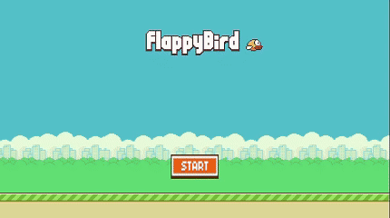

# 🐦 Flappy Bird Clone

Una recreación del clásico juego Flappy Bird desarrollada en Unity como parte del curso de ¡Flappy Bird en Unity! de DEValen (Valentín Gartner). Este proyecto fue creado con el objetivo de aprender y practicar conceptos fundamentales de desarrollo de juegos.

## 🎮 Características Implementadas

- Mecánicas de juego fieles al original:
  - Sistema de salto del pájaro
  - Generación procedural de tuberías
  - Sistema de puntuación
  - Detección de colisiones
- Interfaz de usuario responsive
- Sistema de high scores
- Efectos visuales y animaciones

## 🛠️ Tecnologías y Conceptos Aplicados

- **Unity 2D**
  - Sistema de físicas 2D
  - Sprite Rendering
  - Animation System
  - Particle Systems
  
- **Programación en C#**
  - Object Pooling para tuberías
  - Singleton Pattern
  - Event System
  - Coroutines

- **Conceptos de Gameplay**
  - Difficulty Scaling
  - Score System
  - Game State Management
  - Input Handling

## 📚 Aprendizajes Clave

Durante el desarrollo de este proyecto, adquirí experiencia en:

1. **Optimización de Rendimiento**
   - Implementación de object pooling
   - Gestión eficiente de recursos
   - Optimización de físicas

2. **Diseño de Juegos**
   - Balance de dificultad
   - Game feel y juiciness
   - Experiencia de usuario

## 🎯 Objetivos del Proyecto

- [x] Recrear las mecánicas principales del juego original
- [x] Implementar un sistema de puntuación
- [x] Crear una UI responsive
- [x] Implementar guardado de high scores

## 🕹️ Cómo Jugar

1. Toca la pantalla o presiona la barra espaciadora para hacer que el pájaro salte
2. Navega entre las tuberías sin chocar
3. Cada tubería superada suma un punto

## 💡 Mejoras Propuestas

- [ ] Modo de dificultad adicional
- [ ] Sistema de sonido
- [ ] Diferentes skins para el pájaro
- [ ] Sistema de logros
- [ ] Efectos visuales mejorados

## 🎓 Créditos

- Desarrollado como parte del curso ¡Flappy Bird en Unity! en Udemy
- Sprites y assets basados en el juego original de Dong Nguyen
